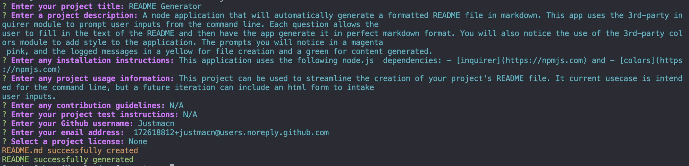

  
  # Readme Generator 

  ## Description

  A node application that will automatically generate a formatted README file in markdown. This app uses the 3rd-party inquirer module to prompt user inputs from the command line. Each question allows the user to fill in the text of the README and then have the app generate it in perfect markdown format. 
  
  You will also notice the use of the 3rd-party colors module to add style to the application. The prompts you will notice in a magenta pink, and the logged messages in a yellow for file creation and a green for content generated. 
  
  And finally, the application will automatically add the license badge to your README, matching the license selected during prompting. The badge is applied with a tiny bit of CSS styling to float it right in the title margins.

  ## Table of Contents

  - [Installation](#installation)

  - [Usage](#usage)

  - [Contributing](#contributing)

  - [Tests](#tests)

  - [Questions](#questions)

  - [Links](#links)

  ## Installation

  This application uses the following node.js  dependencies: 
  - [inquirer@8.2.4](https://www.npmjs.com/package/inquirer) 
  - [colors](https://www.npmjs.com/package/colors)

  ## Usage

  This project can be used to streamline the creation of your project's README file. It current usecase is intended for the command line, but a future iteration can include an html form to intake user inputs.

  --
  

  *Screenshot of generator prompts:*

  ## Contributing

  N/A

  ## Tests

  N/A

  ## Questions

  For any additional questions you can reach me at:

  - Github: [Justmacn](https://github.com/Justmacn)

  - Email: 172618812+justmacn@users.noreply.github.com

  ## Links

  The project repository can be located [here](https://github.com/justmacn/Readme-Generator).
  